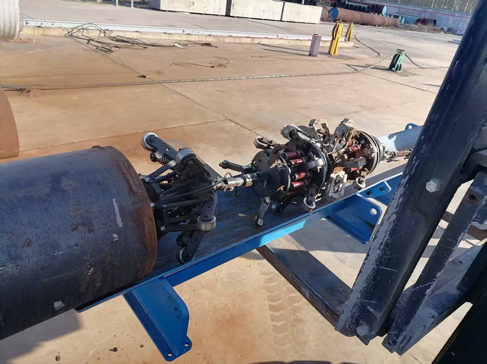
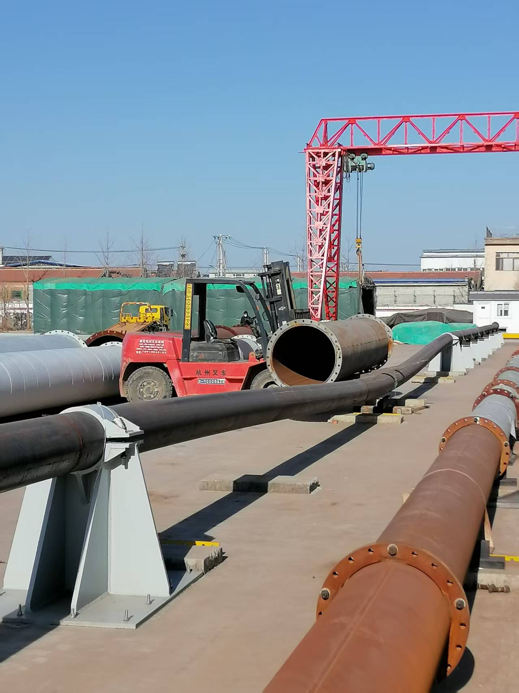
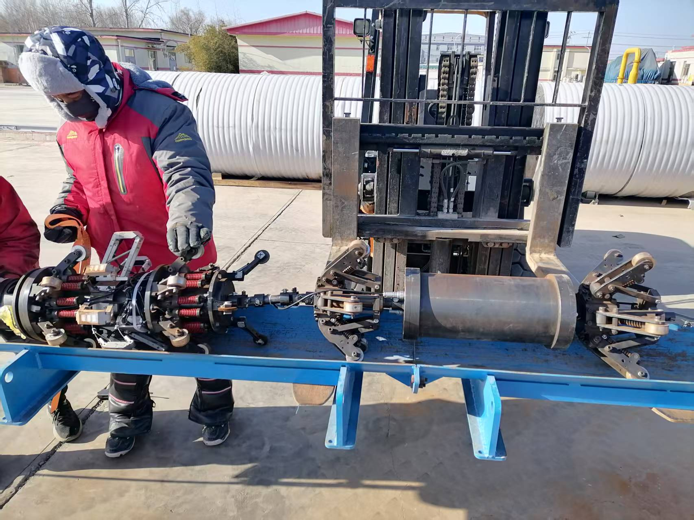

On December 30th, 2024, Pipeline China Inc. and Tsinghua University jointly conducted a pull-through test in the Daxing District of Beijing.
The experimental data and results are publicly available in this dataset.
Additionally, they serve as supplementary material for the paper, “A Dead Reckoning Factor Graph in Graphical State Space for Pipeline Mapping”.

